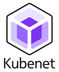

---
hide:
  - navigation
---

The Kubenet community has been created with the goal to help network engineers understand the potential of kubernetes for network automation. While we discuss networking, we are NOT talking about CNI(s) here, but about using `kubernetes` as an automation/orchestration engine to manage physical, virtual or containerized NOS(s).

If you are interested to learn and discuss [join us](https://discord.gg/fH35bmcTU9)

## Meet us in person

We have a workshop about Kubenet on Tuesday, 19 November from 9 AM on [AutoCon 2](https://networkautomation.forum/autocon2)
in Denver. See you there!

## Why

Kubernetes stands out as the most extensive and robust automation and orchestration system available today. Originally focussed on container orchestration but leveraged across many industries, beyond container orchestration. The question to ask here is why is the networking industry not leveraging kubernetes for network automation. The Kubenet community is setup with to goal to help understand networking engineers the potential of kubernetes for network automation.

Here are some attributes to consider why kubernetes is a good automation platform:

- Open Source: As an open-source platform, Kubernetes offers transparency, flexibility, and a collaborative community-driven approach. This fosters innovation and continuous improvement.
- Highly Extendable: Kubernetes is designed to be highly extendable, allowing for customization and integration with various tools and services to meet specific needs.
- Vast Ecosystem: The Kubernetes ecosystem is immense, with a wide range of tools, plugins, and extensions available. This ecosystem provides the resources needed to build comprehensive automation solutions.
- Declarative Model: Kubernetes uses a declarative model, making it easier to define and manage the desired state of network configurations.
- Event-Driven and Continuous Reconciliation: Kubernetes supports event-driven automation and continuous reconciliation, ensuring that the network’s state is consistently aligned with the defined configurations.
- Collaborative Approach with GitOps: Leveraging GitOps principles, Kubernetes enables a collaborative approach to network management. Changes can be tracked, reviewed, and deployed using version control systems, enhancing transparency and collaboration.
- Extensive Knowledge Base: The widespread adoption of Kubernetes means there is a vast knowledge base and a large community of experts. This allows organizations to leverage existing expertise to extend and optimize their automation systems.

## Use cases

Independent on physical, virtual or containerized networking systems

Use cases:

- Datacenter networking
- WAN networking
- Peering
- Access/Campus networking
- Core networking
- Backhaul/Fronthaul
- Cloud Networking

Scenario's: 

- day-0, day-1, day-2 operations
- lifecycle management
- config management

## Kubenet components

Kubenet uses a set of open source components to implement the target use cases. These components are listed in the next
subchapters. 

### [KUID](https://kuidio.github.io/docs/)

An inventory and identity system, which allows to create resources and claim identifier required for networking (e.g. IPAM, VLAN, AS, etc). Some people think of this as a source of truth.

### [SDCIO](https://docs.sdcio.dev/)

A SW component that maps a kubernetes manifest to a YANG based system.

### [KForm](https://docs.kform.dev/)

 A framework that brings the power of 'KRM as code or data' to Kubernetes. With Kform, orchestrating KRM resources becomes a easy through intuitive and human-readable configuration files. These files are not only reusable and shareable but can also be version-controlled, ensuring seamless collaboration among team members.

### [pkgserver](https://docs.pkgserver.dev/)

A SW component that provides 2 way git access to kubernetes: basically read and write to a repository.

## Join us

Join us on this journey as we learn how to leverage kubernetes for network automation.

Have questions, ideas, bug reports or just want to chat? Come join [our discord server](https://discord.gg/fH35bmcTU9).

[KRM]: https://github.com/kubernetes/design-proposals-archive/blob/main/architecture/resource-management.md
[GITOPS]: https://opengitops.dev
[YAML]: https://en.wikipedia.org/wiki/YAML
[srlinux]: https://learn.srlinux.dev